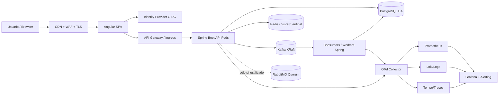
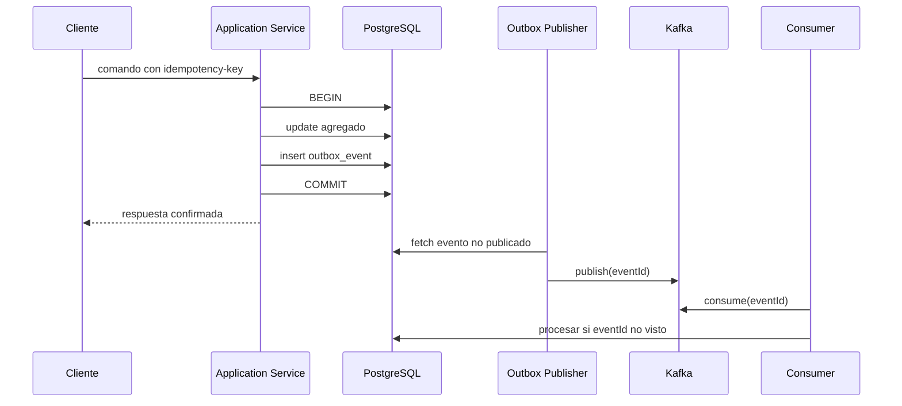

# Stack técnico estándar de producción — Aplicación web Angular + Java Spring + PostgreSQL

**Documento:** `stack-tech_spec.md`  
**Versión:** 1.0  
**Fecha de baseline:** 30 de mayo de 2026  
**Estado:** Especificación de referencia para arquitectura, construcción y operación  
**Tipo de solución:** Aplicación web empresarial, API-first, cloud-native, segura y observable

---

## 1. Propósito y criterio de diseño

Este documento define un stack técnico de referencia para una aplicación web moderna con frontend Angular, backend Java/Spring y PostgreSQL, preparada para operar en producción con requisitos exigentes de seguridad, integridad transaccional, rendimiento, escalabilidad horizontal, alta disponibilidad, observabilidad y mantenibilidad.

La especificación evita dos errores frecuentes:

1. **Confundir una lista extensa de tecnologías con una arquitectura madura.** Kafka, RabbitMQ y Redis no deben introducirse por moda; cada componente aumenta la complejidad operativa, la superficie de ataque, el coste de observabilidad y los escenarios de fallo.
2. **Convertir prematuramente el sistema en microservicios.** Para la mayoría de aplicaciones nuevas, un **monolito modular con arquitectura hexagonal**, preparado para extraer servicios únicamente cuando haya razones verificables de dominio, equipo o escalado, es más seguro y sostenible que una malla inicial de microservicios.

### 1.1 Objetivos no funcionales de referencia

| Dimensión | Objetivo inicial de producción | Evolución esperada |
|---|---:|---:|
| Disponibilidad mensual de API crítica | 99,9 % | 99,95 % si el negocio lo exige |
| Latencia API síncrona (p95 / p99) | < 300 ms / < 800 ms, excluyendo terceros | Ajustar por journey |
| Error rate de endpoints críticos | < 0,5 % | Error budget por SLO |
| RPO PostgreSQL | ≤ 5 min | 0–1 min según criticidad |
| RTO plataforma | ≤ 60 min | ≤ 15 min con madurez operativa |
| Seguridad | OWASP ASVS nivel 2 como mínimo | Nivel 3 en dominios críticos |
| Deployments | Sin parada perceptible | Progressive delivery |
| Trazabilidad | Request/event correlation end-to-end | SLOs y alertas por dominio |
| Privacidad | Minimización y cifrado | DPIA/controles regulatorios si aplica |

### 1.2 Principios rectores

- **Security by design y least privilege.**
- **PostgreSQL es la fuente de verdad transaccional**; las cachés y sistemas de mensajería son derivados o mecanismos de integración.
- **API contract-first** mediante OpenAPI y compatibilidad hacia atrás.
- **Arquitectura hexagonal / ports & adapters** dentro de límites de dominio explícitos.
- **Clean Architecture y código limpio**, evitando abstracciones ceremoniales que no protejan reglas de negocio.
- **Stateless backend** salvo persistencia y mecanismos externos explícitos.
- **Observability by default:** métricas, logs estructurados y trazas distribuidas.
- **Automatización reproducible:** infraestructura como código, GitOps/CI-CD, quality gates y supply-chain security.
- **Failure-aware design:** timeouts, circuit breaker, bulkheads, retries selectivos, idempotencia y degradación controlada.
- **Evolutionary architecture:** introducir distribución, mensajería adicional o event sourcing sólo ante necesidades demostrables.

---

## 2. Baseline tecnológico recomendado

La tabla propone una baseline vigente a la fecha del documento. Las versiones *patch* deben actualizarse continuamente mediante gestión de vulnerabilidades y pruebas automatizadas.

| Capa | Elección recomendada | Baseline 30/05/2026 | Justificación / decisión |
|---|---|---:|---|
| Frontend framework | Angular | **21.x** | Versión activamente soportada; aplicación standalone, lazy loading y build moderno. |
| Frontend runtime/build | Node.js LTS compatible + TypeScript | Node 22.x LTS o 24.x; TS `>=5.9 <6` | Compatibilidad oficial con Angular 21. |
| UI | Angular Material/CDK o design system corporativo | Compatible con Angular 21 | Accesibilidad, consistencia y control de diseño. |
| Backend runtime | Java | **JDK 25 LTS** | Último LTS; elegir distribución con soporte y parches definidos. |
| Backend framework | Spring Boot | **4.0.6+ patch** | Compatible con Java 25; Spring Framework 7. |
| Seguridad backend | Spring Security OAuth2 Resource Server | alineado BOM Spring Boot | Validación estándar OIDC/OAuth2 JWT/opaque tokens. |
| Persistencia | Spring Data JPA + Hibernate; JDBC/jOOQ para consultas críticas | BOM Spring Boot | Productividad con escape hatch para SQL controlado. |
| Migraciones BD | Flyway | versión gestionada por BOM/compatibilidad | Migraciones inmutables, versionadas y auditables. |
| Base de datos OLTP | PostgreSQL | **18.4+ patch** | Fuente de verdad ACID; 18.4 incluye correcciones de seguridad publicadas el 14/05/2026. |
| Pooling | HikariCP + PgBouncer opcional | según carga | Pool por instancia; PgBouncer cuando el número de conexiones sea limitante. |
| Cache/ephemeral state | Redis | **8.x parcheado** | Cache-aside, rate limiting distribuido, locks con cautela; nunca fuente principal de verdad. |
| Event streaming | Apache Kafka en modo KRaft | **4.3.x+ patch** | Eventos durables, replay, integración y alto throughput. |
| Work queues opcionales | RabbitMQ quorum queues | **4.3.x+ patch** | Sólo para colas de comandos/trabajos, routing AMQP o prioridades justificadas. |
| Resiliencia aplicación | Resilience4j | compatible con Spring Boot 4 | Circuit breaker, retry, bulkhead, time limiter y rate limiter. |
| API gateway / ingress | Gateway gestionado cloud o Kubernetes Gateway/Ingress | actual soportado | TLS termination, WAF, routing, throttling y políticas perimetrales. |
| Contenedores | OCI/Docker, imágenes distroless o minimal | imágenes fijadas por digest | Reproducibilidad y reducción de superficie de ataque. |
| Orquestación | Kubernetes gestionado | **1.36** o minor soportada por proveedor | Mantenerse en ventana de soporte de tres minors. |
| Packaging K8s | Helm + Kustomize opcional | actual compatible | Despliegues por entorno sin copiar manifests. |
| IaC | Terraform/OpenTofu | versión corporativa fijada | Infraestructura reproducible y revisable. |
| GitOps opcional | Argo CD | versión corporativa fijada | Estado deseado, auditoría y rollback operativo. |
| Telemetría | OpenTelemetry + OTLP Collector | versión estable compatible | Protocolo estándar para trazas, métricas y logs. |
| Métricas | Prometheus + Alertmanager | actual compatible | Métricas, recording/alerting rules. |
| Visualización | Grafana | actual compatible | Dashboards y alerting operacional. |
| Logs | Loki o plataforma corporativa/managed logs | actual compatible | Logs estructurados correlacionables. |
| Traces | Tempo o plataforma APM corporativa | actual compatible | Distributed tracing y análisis de latencia. |
| Testing integración | Testcontainers | compatible con Java 25 | PostgreSQL/Kafka/Redis reales en tests. |
| Contract testing | OpenAPI validation + Pact opcional | según integración | Evita roturas entre consumidores y API. |
| SAST/SCA/secrets | Semgrep/CodeQL + Dependabot/Renovate + Gitleaks | corporativo | Quality gates y vulnerabilidades. |
| Container/IaC scan | Trivy + Checkov/terrascan | corporativo | Supply chain e infraestructura segura. |
| SBOM/firma | CycloneDX/Syft + Cosign | corporativo | Trazabilidad de artefactos y firma verificable. |

### 2.1 Notas de selección tecnológica

- **Angular 21** es la baseline de frontend; el portal oficial marca Angular 21 y 20 como versiones activamente soportadas y especifica compatibilidades de Node, TypeScript y RxJS.
- **Java 25 LTS**, y no Java 26, es la baseline productiva: Java 26 es feature release, mientras que JDK 25 es el último LTS.
- **Spring Boot 4.0.x** es apropiado para un proyecto nuevo; para una organización con plataforma aún homologada en Boot 3.5.x, se deberá registrar una decisión de arquitectura y un plan de actualización.
- **PostgreSQL 18.4 o posterior dentro de la rama soportada** es requisito mínimo debido a las correcciones de seguridad de mayo de 2026.
- **Kafka y RabbitMQ no son equivalentes.** Kafka es el backbone de eventos durables/reproducibles; RabbitMQ es opcional para trabajo asíncrono dirigido, routing complejo AMQP o prioridades.
- **Redis no sustituye PostgreSQL, Kafka ni un gestor de secretos.**

---

## 3. Arquitectura objetivo

### 3.1 Modelo de despliegue recomendado: monolito modular primero

Para el primer release productivo, se recomienda:

- Una aplicación Angular independiente desplegada como contenido estático tras CDN/WAF.
- Un backend Spring Boot modular, replicable horizontalmente y sin estado local de sesión.
- PostgreSQL administrado en alta disponibilidad como sistema de registro.
- Redis sólo donde existan casos de uso medibles.
- Kafka cuando exista integración asíncrona, auditoría/eventos de negocio, CDC o consumidores desacoplados.
- RabbitMQ sólo si los requisitos de trabajos/colas lo hacen mejor ajuste que Kafka.

La extracción de microservicios se aprobará cuando exista al menos una causa explícita:

| Motivo válido de extracción | Evidencia requerida |
|---|---|
| Escalado muy distinto de un bounded context | Métricas de consumo, latencia o throughput |
| Aislamiento de fallo/regulación | Riesgo documentado y control exigido |
| Autonomía real de equipo y ciclo de entrega | Ownership estable y contrato API/eventos |
| Tecnología o disponibilidad distinta | ADR y coste operativo evaluado |
| Volumen/latencia incompatible con el módulo actual | Profiling y prueba de carga |

### 3.2 Vista de contenedores



### 3.3 Contextos funcionales de ejemplo

La solución debe organizarse por **dominio**, no por capas técnicas globales. Un ejemplo genérico:

- `identity-access`: identidad delegada, perfiles internos y permisos de aplicación.
- `customer` o `account`: agregado principal según negocio.
- `catalog` / `configuration`: datos de referencia.
- `workflow` / `orders`: proceso transaccional principal.
- `notification`: notificaciones externas, preferentemente consumidor asíncrono.
- `audit`: auditoría de negocio y seguridad.
- `integration`: adaptadores hacia terceros y publicación/consumo de eventos.

Cada contexto debe declarar propietarios, agregados, invariantes, API pública, eventos publicados, datos personales y SLO aplicable.

---

## 4. Frontend Angular

### 4.1 Estructura y estilo arquitectónico

Implementar Angular como aplicación **standalone**, organizada por features y lazy-loaded:

```text
frontend/
  src/app/
    core/                        # auth, interceptors, config, shell, errores globales
      auth/
      http/
      observability/
    shared/                      # componentes presentacionales reutilizables
      ui/
      directives/
      pipes/
    features/
      workflow/
        pages/
        components/
        data-access/
        models/
        routes.ts
      account/
      administration/
    app.config.ts
    app.routes.ts
  public/
  environments/                  # sólo config no secreta/inyección en runtime
  eslint.config.*
  angular.json
```

Normas:

- Componentes standalone y rutas con lazy loading.
- `ChangeDetectionStrategy.OnPush` donde sea aplicable; signals para estado local/derivado.
- Estado global reducido: utilizar servicios/signals; introducir NgRx sólo para flujos complejos, auditables o multipágina con valor claro.
- Ningún secreto, client secret ni clave API en el bundle frontend.
- Los DTO de API deben generarse o validarse desde el contrato OpenAPI; evitar duplicación manual descontrolada.
- Manejo de errores uniforme y correlación mediante `traceparent`/correlation ID retornado por backend.

### 4.2 UX, rendimiento y accesibilidad

- SSR/hydration únicamente si SEO, time-to-content o canales públicos lo necesitan; no introducirlo en backoffices autenticados sin evidencia.
- Lazy loading por rutas y división de bundles.
- Budgets de bundle y comprobación en CI.
- Imágenes optimizadas, fuentes limitadas, caching de estáticos versionados.
- Accesibilidad alineada con WCAG 2.2 AA: teclado, foco, contraste, labels, ARIA correcto y tests automatizados complementados por revisión manual.
- Internacionalización mediante Angular i18n o librería homologada, sin textos de negocio dispersos.

### 4.3 Seguridad frontend

Controles obligatorios:

- Autenticación OIDC usando **Authorization Code Flow con PKCE** para SPA.
- Preferencia por patrón **BFF (Backend for Frontend)** cuando la criticidad de seguridad justifique evitar tokens de acceso persistentes en navegador; si SPA directa, almacenar tokens únicamente de forma temporal y endurecer contra XSS.
- Nunca utilizar `localStorage` para tokens de larga duración.
- CSP estricta, Trusted Types y AOT en producción.
- No usar `bypassSecurityTrust*` salvo excepción revisada y con prueba de seguridad.
- Protección CSRF cuando exista autenticación basada en cookie/BFF (`SameSite`, token CSRF y validación backend).
- Protección contra clickjacking (`frame-ancestors` en CSP).
- Dependencias actualizadas y sin personalizar forks del framework sin gobernanza de parches.

Headers recomendados en el borde/CDN o backend que entrega la SPA:

```http
Content-Security-Policy: default-src 'self'; script-src 'self'; object-src 'none'; base-uri 'self'; frame-ancestors 'none'; connect-src 'self' https://api.example.com https://idp.example.com; require-trusted-types-for 'script'
Strict-Transport-Security: max-age=31536000; includeSubDomains; preload
X-Content-Type-Options: nosniff
Referrer-Policy: strict-origin-when-cross-origin
Permissions-Policy: camera=(), microphone=(), geolocation=()
```

---

## 5. Backend Java / Spring Boot

### 5.1 Stack backend

| Responsabilidad | Tecnología / práctica |
|---|---|
| Runtime | JDK 25 LTS, contenedor con JVM configurada para límites cgroup |
| Framework | Spring Boot 4.0.6+ y Spring Framework 7 |
| Web API | Spring MVC para APIs transaccionales estándar; WebFlux sólo cuando el flujo sea realmente reactivo end-to-end |
| Validación | Jakarta Bean Validation en DTO de entrada + invariantes en dominio |
| Mapping | MapStruct opcional; no exponer entidades JPA como DTO |
| Persistencia | Spring Data JPA/Hibernate para agregados; SQL/JdbcClient/jOOQ en consultas complejas o reporting |
| Seguridad | Spring Security Resource Server OIDC/OAuth2; method security sólo como segunda barrera, no sustituto de autorización de dominio |
| Migración schema | Flyway: scripts forward-only y repeatable controlados |
| Documentación API | OpenAPI 3.x versionado y publicado en pipeline |
| Resiliencia | Resilience4j + timeouts explícitos |
| Observabilidad | Spring Boot Actuator + Micrometer + OpenTelemetry/OTLP |
| Mensajería | Spring for Apache Kafka; Spring AMQP únicamente para RabbitMQ aprobado |
| Serialización eventos | JSON Schema o Avro/Protobuf + schema registry si hay múltiples consumidores/evolución fuerte |

### 5.2 Arquitectura hexagonal por módulo

Estructura backend recomendada:

```text
backend/
  pom.xml
  src/main/java/com/example/platform/
    boot/                                      # composición, configuración, arranque
    sharedkernel/                              # mínimos tipos realmente compartidos
    workflow/
      domain/
        model/                                # aggregates, entities, value objects
        service/                              # domain services
        event/                                # domain events
        exception/
      application/
        port/in/                              # use cases
        port/out/                             # repositorios, publisher, gateways, clock
        service/                              # application services / transactions
        command/
        query/
      adapter/
        in/web/                               # REST controllers, DTO, mappers
        in/messaging/                         # consumers
        out/persistence/                      # JPA entities/repos/adapters
        out/messaging/                        # Kafka/Rabbit publishers
        out/http/                             # third-party clients
    account/
      ...
  src/test/java/
```

#### Regla de dependencias

```text
adapter/in  --> application --> domain
adapter/out --> application --> domain
boot        --> todos para ensamblaje
domain      --> ningún framework
```

- El dominio no depende de Spring, JPA, Kafka, Redis ni HTTP.
- La capa application delimita casos de uso y transacciones.
- Los adaptadores traducen protocolos y detalles tecnológicos.
- Evitar un `shared` masivo que destruya los límites de módulo.

### 5.3 API REST

Normas de API:

- Recursos y comandos definidos consistentemente; evitar APIs RPC accidentales.
- Base path versionado sólo cuando exista ruptura no compatible: `/api/v1/...`.
- OpenAPI como contrato versionado; validación de compatibilidad en CI.
- `application/problem+json` para errores según RFC 9457.
- Paginación cursor-based en conjuntos grandes; offset únicamente en tablas pequeñas/administración.
- Filtrado y ordenación mediante allowlists, nunca concatenación SQL.
- Idempotency keys obligatorias para creación/pago/comandos repetibles por reintento de cliente.
- ETags/optimistic concurrency para actualizaciones susceptibles a edición concurrente.
- Correlation ID y trazas propagados en cada request.

Ejemplo de error:

```json
{
  "type": "https://errors.example.com/workflow/invalid-transition",
  "title": "Transición no válida",
  "status": 409,
  "detail": "El expediente no puede aprobarse desde su estado actual.",
  "instance": "/api/v1/workflows/01J.../approval",
  "traceId": "4f8b..."
}
```

---

## 6. Datos y PostgreSQL

### 6.1 Rol de PostgreSQL

PostgreSQL es el **system of record** para:

- estados e invariantes del negocio;
- usuarios/perfiles propios de aplicación si existen;
- auditoría de negocio que exija integridad;
- outbox transaccional;
- configuración persistente.

No almacenar la verdad de negocio únicamente en Redis, Elasticsearch/OpenSearch, Kafka compactado o cachés del cliente.

### 6.2 Diseño de esquema

Prácticas:

- Identificadores preferentemente UUIDv7/ULID o UUID generado de forma coherente; evitar IDs predecibles expuestos cuando agraven BOLA.
- Tipos correctos: `timestamptz`, `numeric` para dinero con moneda explícita, `jsonb` sólo para datos semiestructurados justificados.
- Constraints en BD para invariantes estructurales: `NOT NULL`, `CHECK`, `UNIQUE`, FKs.
- Índices derivados de queries reales y `EXPLAIN (ANALYZE, BUFFERS)`, no índices indiscriminados.
- Evitar borrado físico cuando auditoría/regulación demande retención; diseñar soft-delete con cuidado porque complica unique constraints y queries.
- PII clasificada, minimizada y cifrada cuando el modelo de amenazas lo exija.
- Separar datos operacionales de reporting analítico pesado mediante réplica/ETL/eventos.

### 6.3 Migraciones

- Flyway en repositorio junto al servicio propietario del schema.
- Migraciones inmutables una vez desplegadas; añadir nueva migración para corregir.
- Estrategia **expand-and-contract** en despliegues sin parada:
  1. añadir campo/tabla compatible;
  2. desplegar código que escribe/lee compatible;
  3. backfill controlado;
  4. migrar consumidores;
  5. retirar campo anterior en release posterior.
- Nunca ejecutar cambios bloqueantes grandes sin evaluar locks, tamaño de tabla, timeout y plan de rollback operativo.
- Backups restaurables probados periódicamente; un backup sin prueba de restore no constituye una garantía.

### 6.4 Alta disponibilidad, backups y DR

Configuración orientativa:

| Necesidad | Control |
|---|---|
| Alta disponibilidad | PostgreSQL gestionado multi-AZ o cluster operado con failover probado |
| Réplicas de lectura | Sólo para consultas compatibles con eventual consistency |
| Backup | Full + WAL/PITR; cifrado y política de retención |
| RPO/RTO | Definidos por criticidad y verificados en simulacros |
| Pool | HikariCP por pod; límites coordinados con `max_connections`; PgBouncer si procede |
| Seguridad red | BD no pública; acceso sólo desde namespaces/subnets autorizados |
| Cifrado | TLS in transit y cifrado de volumen/backup at rest |
| Credenciales | Secrets manager/Vault y rotación; no Git ni imágenes |

### 6.5 Transaccionalidad

#### Transacciones locales

- Aplicar `@Transactional` en application services que implementan un caso de uso; no en controllers.
- Mantener transacciones cortas; no efectuar llamadas HTTP externas dentro de una transacción abierta.
- Nivel por defecto habitual: `READ COMMITTED`; subir a `REPEATABLE READ`/`SERIALIZABLE` únicamente para invariantes que lo precisen y con manejo de reintentos.
- Bloqueo optimista (`@Version`) para edición concurrente; bloqueo pesimista sólo tras medir contención y justificarlo.
- Usar constraints de BD como última defensa contra carreras.

#### Consistencia entre BD y mensajería: Transactional Outbox

No implementar dual write directo `guardar en PostgreSQL` + `publicar en Kafka` en el mismo caso de uso esperando consistencia. El patrón estándar es:

1. Dentro de una única transacción PostgreSQL, persistir el agregado y un registro `outbox_event`.
2. Un publicador asíncrono lee la outbox y publica en Kafka.
3. Tras confirmación, marca/publica estado procesado o utiliza CDC/Debezium.
4. Consumidores procesan eventos de forma idempotente.



#### Sagas

Utilizar saga únicamente si un proceso atraviesa varios servicios/autonomías transaccionales. Preferir:

- **orquestación** para workflows de negocio visibles, con estado de saga persistente;
- **coreografía** para efectos secundarios simples, sin cadena opaca de dependencias.

Nunca asumir "exactly once" end-to-end. Diseñar **at-least-once + idempotencia**.

---

## 7. Redis: caché y estado efímero

### 7.1 Casos de uso aceptados

- Cache-aside de lecturas costosas y tolerantes a obsolescencia.
- Rate limiting distribuido.
- Tokens de un solo uso, nonce o estado efímero de corta duración.
- Locks distribuidos sólo para coordinación no crítica o con diseño robusto; no sustituir integridad de BD.
- Sesiones server-side si el patrón de autenticación lo requiere.

### 7.2 Controles obligatorios

- Redis en red privada, autenticado, TLS y ACLs mínimas.
- Versión parcheada; política explícita de actualización ante CVEs.
- TTL obligatorio para cachés y estado efímero.
- Key prefix por aplicación/entorno y límites de cardinalidad.
- Métricas de hit ratio, memoria, evictions, latencia y replication/failover.
- Evitar almacenar PII no necesaria; cifrar o tokenizar si no puede evitarse.
- Cache invalidation vinculada a actualizaciones de negocio; documentar tolerancia a stale data.

### 7.3 Patrón cache-aside

```text
GET recurso:
  1. Buscar en Redis.
  2. Si hit válido, devolver.
  3. Si miss, consultar PostgreSQL, almacenar con TTL+jitter y devolver.

UPDATE recurso:
  1. Commit en PostgreSQL.
  2. Invalidar cache después del commit o mediante evento fiable.
```

Para evitar cache stampede: TTL con jitter, locking ligero por clave o stale-while-revalidate si la consistencia lo admite.

---

## 8. Mensajería y eventos

### 8.1 Decisión Kafka versus RabbitMQ

| Caso | Kafka | RabbitMQ |
|---|---:|---:|
| Eventos de dominio durables con replay | Recomendado | No primera opción |
| Integración con múltiples consumidores independientes | Recomendado | Posible, menos natural |
| Streaming/analytics/CDC | Recomendado | No |
| Cola de trabajos con ack/requeue/routing AMQP | Posible | Recomendado |
| Prioridades estrictas de trabajo | No ideal | Recomendado si requerido |
| Request/response síncrono | No | No; usar HTTP/gRPC |
| Introducir por "estar completo" | No | No |

**Baseline mínima:** Kafka si hay event-driven integration.  
**RabbitMQ:** componente condicional, no dependencia obligatoria del producto.

### 8.2 Kafka

Configuración conceptual:

- Cluster KRaft en alta disponibilidad, multi-AZ en producción.
- Topics por evento/capacidad, no por consumidor.
- Particionado definido por clave de orden de negocio (`aggregateId` cuando deba preservarse orden por agregado).
- Replication factor y `min.insync.replicas` acordes con HA.
- Productores con `acks=all`, idempotencia habilitada y timeouts explícitos.
- Consumers con consumer groups separados por responsabilidad.
- Dead-letter topic (DLT) para fallos no recuperables; no esconder fallos infinitamente mediante retry.
- Schema evolution compatible mediante schema registry cuando el ecosistema lo requiera.
- Autorización ACL por producer/consumer/topic; TLS y autenticación.
- No enviar PII innecesaria en eventos; clasificar y retener conforme a normativa.

Convención de evento:

```json
{
  "eventId": "01976e09-...",
  "eventType": "WorkflowApproved",
  "eventVersion": 1,
  "occurredAt": "2026-05-30T10:15:30Z",
  "aggregateId": "01976df1-...",
  "correlationId": "f4a3...",
  "causationId": "b8c2...",
  "producer": "workflow-service",
  "data": {
    "workflowId": "01976df1-...",
    "status": "APPROVED"
  }
}
```

### 8.3 RabbitMQ, si se aprueba

- Utilizar **quorum queues** en producción para durabilidad/replicación.
- Exchanges, routing keys y DLX definidos como contratos.
- Mensajes persistentes, publisher confirms y consumers idempotentes.
- Prefetch ajustado para evitar consumidores monopolistas.
- TTL/DLQ y política de poison messages.
- No duplicar el mismo evento de negocio en Kafka y RabbitMQ sin un puente/propósito documentado.

### 8.4 Idempotencia de consumidores

Todo consumidor que cambie estado debe registrar el identificador de evento/proceso ya aplicado, idealmente dentro de la misma transacción que su efecto:

```sql
CREATE TABLE processed_message (
  consumer_name text NOT NULL,
  event_id uuid NOT NULL,
  processed_at timestamptz NOT NULL DEFAULT now(),
  PRIMARY KEY (consumer_name, event_id)
);
```

---

## 9. Seguridad integral

### 9.1 Estándares y amenazas

Baseline de verificación:

- OWASP ASVS nivel 2 como acceptance criteria; nivel 3 para operaciones críticas/alta sensibilidad.
- OWASP Top 10:2025 para aplicación web.
- OWASP API Security Top 10:2023 para endpoints, destacando BOLA y autenticación rota.
- Modelado de amenazas por feature crítica (STRIDE u otro método corporativo).
- Privacidad desde diseño: clasificación de datos, retención, borrado, exportación y minimización.

### 9.2 Identidad, autenticación y autorización

Arquitectura:

- Identity Provider corporativo compatible OIDC/OAuth2 (por ejemplo, Keycloak o servicio gestionado aprobado).
- Frontend: Authorization Code + PKCE; BFF recomendado en aplicaciones de alta sensibilidad.
- API: Spring Security OAuth2 Resource Server validando issuer, audience, firma, expiración y scopes/claims.
- Tokens cortos; refresh tokens protegidos por el canal apropiado.
- MFA, conditional access y políticas del IdP para usuarios privilegiados.
- Cuentas técnicas con client credentials, scopes mínimos y rotación.

Autorización:

- RBAC para permisos generales; ABAC/políticas de dominio para acceso a recursos concretos.
- Control de propiedad/tenant en **cada** acceso por identificador, evitando BOLA.
- Separación de roles administrativos y maker-checker donde el negocio lo exija.
- Deny-by-default.
- Auditoría para cambios de permisos, accesos sensibles y acciones administrativas.

### 9.3 API y perímetro

- TLS 1.2+ / preferencia TLS 1.3; HSTS.
- WAF/CDN/API Gateway con rate limiting, reglas anti-bot cuando aplique, tamaño máximo de payload y protección DDoS del proveedor.
- CORS allowlist exacta por entorno; nunca `*` con credenciales.
- Validación de entrada: tamaño, formato, enum, allowlists; rechazar campos inesperados si el contrato lo requiere.
- Output encoding y sanitización.
- Uploads: antivirus/sandbox, límites, content-type validado, almacenamiento aislado, URLs firmadas con expiración.
- SSRF: deny-by-default para destinos salientes; proxy/egress policy; no aceptar URLs arbitrarias.
- Webhooks: firma, timestamp/replay protection e idempotencia.

### 9.4 Secretos y criptografía

- Secrets en Vault/secret manager cloud; Kubernetes Secret sólo como mecanismo de entrega, cifrado en reposo y con RBAC estricto.
- Nunca incluir secretos en Git, logs, bundles Angular, variables visibles del pipeline o imágenes.
- Rotación automatizada cuando sea posible.
- Claves de cifrado gestionadas con KMS/HSM; separación por entorno.
- Contraseñas, si se almacenan localmente por excepción, con algoritmo robusto y configuración vigente (preferiblemente autenticación delegada).
- Cifrado a nivel de campo para PII especialmente sensible cuando el riesgo lo demande.
- En logs y eventos: masking/tokenización.

### 9.5 Seguridad de contenedores y Kubernetes

Controles mínimos:

- Imágenes mínimas, sin shell si no es necesario, ejecutadas como non-root.
- Read-only root filesystem; capabilities eliminadas; seccomp `RuntimeDefault`.
- Pod Security Admission con perfil `restricted` para namespaces de aplicación.
- NetworkPolicies default-deny egress/ingress, abriendo únicamente flujos requeridos.
- ServiceAccounts específicos; RBAC mínimo; no montar tokens si no son necesarios.
- Secrets cifrados y preferentemente sincronizados desde secret manager mediante CSI/operador homologado.
- Recursos requests/limits, probes y disruption budgets.
- Escaneo y firma de imágenes; admisión que impida desplegar imágenes no firmadas o vulnerables sobre umbral.
- Separación de entornos/cuentas/proyectos; producción no comparte credenciales ni datos con no productivo.

Ejemplo de `securityContext` mínimo:

```yaml
securityContext:
  runAsNonRoot: true
  runAsUser: 10001
  allowPrivilegeEscalation: false
  readOnlyRootFilesystem: true
  capabilities:
    drop: ["ALL"]
  seccompProfile:
    type: RuntimeDefault
```

### 9.6 Supply chain y SDLC seguro

Pipeline mínimo:

1. Branch protection, revisión obligatoria y commits/artefactos trazables.
2. Lint + unit tests + architectural tests.
3. SAST y secret scanning.
4. SCA/dependency vulnerability scanning y policy de licencias.
5. Build reproducible de frontend/backend.
6. Integration tests con Testcontainers.
7. API/contract tests.
8. Build OCI image por digest.
9. Container scan y SBOM CycloneDX/SPDX.
10. Firma Cosign y almacenamiento en registry privado.
11. IaC scan y policy-as-code.
12. Deploy a staging, DAST/smoke/performance tests selectivos.
13. Promoción a producción con aprobación/riesgo según entorno.
14. Verificación post-deploy y rollback automático/manual ensayado.

---

## 10. Resiliencia y patrones de fallo

### 10.1 Regla principal

Los patrones de resiliencia se aplican en límites de red o recursos agotables; no deben ocultar bugs funcionales ni convertir fallos persistentes en tormentas de reintentos.

| Patrón | Aplicación correcta | Error común |
|---|---|---|
| Timeout | Toda llamada remota/consulta costosa con presupuesto | Esperar indefinidamente |
| Retry | Fallos transitorios e idempotentes, con backoff+jitter | Reintentar POST no idempotente o errores 4xx |
| Circuit Breaker | Dependencias externas inestables | Usarlo en lógica local |
| Bulkhead | Aislar pools/concurrencia por dependencia | Un pool global que colapsa todo |
| Rate Limiter | Proteger API/terceros/coste | Limitar sin distinguir clientes críticos |
| Fallback | Degradación semánticamente válida | Entregar datos falsos/stale no aceptable |
| Idempotency | Comandos y mensajes duplicables | Confiar en “exactly once” |
| DLQ/DLT | Poison messages investigables | Reintentos eternos invisibles |

### 10.2 Resilience4j

Aplicar a clientes externos y, cuando proceda, operaciones Redis/mensajería; configuración inicial a calibrar mediante métricas:

```yaml
resilience4j:
  timelimiter:
    instances:
      externalCatalog:
        timeoutDuration: 2s
        cancelRunningFuture: true
  circuitbreaker:
    instances:
      externalCatalog:
        slidingWindowType: COUNT_BASED
        slidingWindowSize: 50
        minimumNumberOfCalls: 20
        failureRateThreshold: 50
        slowCallRateThreshold: 50
        slowCallDurationThreshold: 1500ms
        waitDurationInOpenState: 30s
        permittedNumberOfCallsInHalfOpenState: 5
  retry:
    instances:
      externalCatalog:
        maxAttempts: 3
        waitDuration: 200ms
        enableExponentialBackoff: true
        exponentialBackoffMultiplier: 2
  bulkhead:
    instances:
      externalCatalog:
        maxConcurrentCalls: 30
        maxWaitDuration: 0
```

Criterios:

- Definir primero timeout; un circuit breaker sin timeout tarda en detectar dependencia bloqueada.
- Sólo retry para operaciones idempotentes o protegidas por idempotency key.
- Exponer métricas por instancia: llamadas exitosas/fallidas/lentas, circuit state, rejected calls.
- Los fallbacks deben estar acordados con producto y reflejarse en UX/telemetría.

### 10.3 Patrones adicionales

- **Outbox/inbox:** consistencia e idempotencia de eventos.
- **CQRS ligero:** separar queries optimizadas de comandos sólo donde la lectura lo requiera; no implica event sourcing.
- **Optimistic locking:** proteger modificaciones concurrentes.
- **Strangler Fig:** migración gradual de legacy o extracción de módulo.
- **Anti-Corruption Layer:** integración con modelos de terceros sin contaminar dominio.
- **Backend for Frontend:** seguridad y adaptación de experiencia frontend en journeys complejos.
- **Feature flags:** despliegue desacoplado de activación; nunca flags eternos sin ownership/fecha de retirada.

---

## 11. Escalabilidad, clusterización y disponibilidad

### 11.1 Escalabilidad de aplicación

Backend:

- Pods stateless; estado persistente fuera del proceso.
- Horizontal Pod Autoscaler por CPU/memoria y, donde sea viable, métricas de carga (requests, consumer lag).
- Límites de recursos y JVM configurada para contenedores.
- Connection pool dimensionado globalmente: `replicas × pool_max` no debe agotar PostgreSQL.
- Caches locales únicamente para datos muy estáticos y con invalidación/TTL claro.
- Procesamiento batch o pesado separado de APIs síncronas.

Frontend:

- Static assets en CDN, cache busting por hash.
- Compresión Brotli/Gzip, HTTP/2 o HTTP/3 según borde.
- API caché únicamente para recursos permitidos.

### 11.2 Kubernetes

Entornos recomendados:

| Entorno | Propósito | Características |
|---|---|---|
| Local | Desarrollo | Docker Compose/Testcontainers; cluster local opcional |
| Integration | Tests automáticos | Efímero o namespace aislado |
| Staging/preprod | Validación producción-like | Datos anonimizados, misma topología lógica |
| Production | Servicio real | Multi-AZ, RBAC estricto, backups, alerting y DR |

Objetos mínimos por workload:

- `Deployment` con rolling update.
- `Service` interno.
- `HTTPRoute`/Ingress o routing de gateway.
- `ConfigMap` únicamente para no secretos.
- Secret injection desde gestor externo.
- `HorizontalPodAutoscaler`.
- `PodDisruptionBudget`.
- `NetworkPolicy`.
- `ServiceMonitor`/scrape config si Prometheus.
- Probes:

```yaml
livenessProbe:    # proceso bloqueado/irrecuperable
  httpGet: { path: /actuator/health/liveness, port: 8080 }
readinessProbe:   # recibir tráfico; no debe caer por una dependencia opcional
  httpGet: { path: /actuator/health/readiness, port: 8080 }
startupProbe:     # evita liveness prematura en arranque
  httpGet: { path: /actuator/health/liveness, port: 8080 }
```

No incluir PostgreSQL/Kafka externo como fallo de *liveness*: reiniciar pods no repara una dependencia caída y puede agravar un incidente.

### 11.3 Clusterización por componente

| Componente | Topología producción recomendada |
|---|---|
| Spring Boot API | ≥ 2 réplicas entre zonas, autoscaling y PDB |
| PostgreSQL | Servicio gestionado multi-AZ o operador maduro; réplica + PITR |
| Redis | Managed HA o cluster/Sentinel según proveedor; persistencia según uso |
| Kafka | KRaft HA, brokers/controllers distribuidos por zona, replication factor apropiado |
| RabbitMQ opcional | Cluster HA con quorum queues, distribución por zona |
| OTel Collector | Deployment/DaemonSet con redundancia; buffering/export controlado |
| Prometheus | Managed o HA según SLO; retención/long-term storage si requerido |
| Grafana/Loki/Tempo | Managed o HA dimensionado por retención y cardinalidad |

### 11.4 DR y continuidad

- Registrar dependencias críticas y failure modes.
- Backups y restauraciones de PostgreSQL probados.
- Infraestructura recreable desde IaC.
- Runbooks para caída de BD, degradación Kafka, agotamiento Redis, rollback y rotación urgente de secreto.
- GameDays periódicos o pruebas de recuperación.
- Multi-region sólo si RTO/RPO y coste lo justifican; no afirmar resiliencia multi-region sin consistencia y procedimientos probados.

---

## 12. Observabilidad, monitoring y operación

### 12.1 Señales

Implementar las tres señales correlacionadas:

| Señal | Stack | Requisitos |
|---|---|---|
| Métricas | Micrometer → OTLP/Prometheus → Grafana | RED/USE, negocio, JVM, pools, Kafka/Redis/PG |
| Logs | JSON estructurado → OTel/Loki/plataforma managed | `traceId`, `spanId`, `correlationId`, sin secretos/PII |
| Traces | OpenTelemetry → OTel Collector → Tempo/APM | HTTP, JDBC, Kafka, clients externos; sampling controlado |

Spring Boot + Micrometer + OpenTelemetry/OTLP constituye la integración recomendada; se prioriza el protocolo OTLP para no acoplar instrumentación a un proveedor concreto.

### 12.2 Métricas mínimas

**API / aplicación**
- Requests por endpoint y status.
- Latencia p50/p95/p99.
- Error rate.
- Active requests/thread pool.
- JVM heap/non-heap, GC pauses, CPU, virtual/platform threads si procede.
- Resilience4j state/rejected/slow/failed calls.
- Login/auth failures sin información sensible.

**PostgreSQL / persistencia**
- Conexiones activas/espera/max; pool utilization.
- Latencia de queries y slow queries.
- Locks/deadlocks.
- Replication lag.
- Backup/PITR status.
- Storage, IOPS y bloat/vacuum según servicio.

**Kafka**
- Producer errors/latency.
- Consumer lag por consumer group.
- Under-replicated partitions / offline partitions.
- DLT rate y reprocess outcomes.

**Redis**
- Hit/miss ratio.
- Evictions.
- Memory fragmentation/utilization.
- Latencia, conexiones, failover.

**Negocio**
- Comandos completados/fallidos.
- Duración de workflows.
- Eventos outbox pendientes/edad máxima.
- Ratios anómalos relevantes para negocio.

### 12.3 SLOs y alertas

Alertar por impacto, no por ruido:

| Alerta | Señal | Severidad orientativa |
|---|---|---|
| SLO burn rate elevado API crítica | error/latency burn rate | P1/P2 |
| PostgreSQL indisponible o failover fallido | health + conexión | P1 |
| Replication lag amenaza RPO | lag | P2 |
| Outbox sin publicar por encima de umbral | pending age/count | P2 |
| Kafka consumer lag sostenido en proceso crítico | lag/time | P2 |
| Circuit breaker de dependencia crítica abierto sostenido | CB state | P2/P3 |
| Redis degradado con fallback correcto | errors/cache hit | P3 |
| Vulnerabilidad crítica en artefacto desplegado | security scan | P1/P2 según exposición |

Todos los alertas deben tener propietario, runbook, umbral razonado, dashboard vinculado y postmortem cuando corresponda.

### 12.4 Logging

Formato JSON orientativo:

```json
{
  "timestamp": "2026-05-30T10:15:30.123Z",
  "level": "INFO",
  "service": "workflow-api",
  "environment": "prod",
  "traceId": "4f8b...",
  "spanId": "0ac2...",
  "correlationId": "f4a3...",
  "event": "workflow.approved",
  "workflowId": "01976df1-...",
  "message": "Workflow transitioned to APPROVED"
}
```

Prohibido logar: passwords, access/refresh tokens, secretos, payloads íntegros con PII, datos de tarjeta o documentos sensibles.

---

## 13. CI/CD, infraestructura y release engineering

### 13.1 Repositorio

Modelo recomendado para monolito modular:

```text
repo/
  frontend/
  backend/
  deploy/
    helm/
    environments/
  infra/
    modules/
    envs/
  docs/
    adr/
    api/
    runbooks/
    threat-models/
  .github/workflows/ | .gitlab-ci.yml
  renovate.json
  README.md
```

Un monorepo facilita cambios coordinados frontend/API/deployment durante el inicio. Migrar a repositorios separados sólo si ownership, tiempos de build o gobernanza lo requieren.

### 13.2 Branching y releases

- Trunk-based development con branches cortas y PR obligatoria.
- Conventional Commits opcional; versionado SemVer para APIs/librerías y tags inmutables.
- Feature flags para cambios no listos, con limpieza obligatoria.
- Entornos promovidos desde el **mismo artefacto firmado**, variando únicamente configuración externa.
- No recompilar para producción lo validado en staging.

### 13.3 Pipeline de backend

```text
validate -> compile -> unit test -> architecture test -> SAST/SCA/secrets
-> integration tests (PostgreSQL/Kafka/Redis Testcontainers)
-> OpenAPI compatibility/contract tests
-> package OCI image -> image scan -> SBOM -> sign
-> deploy integration/staging -> smoke/DAST/performance gates
-> promote production -> canary/rolling -> verify SLO -> finalize/rollback
```

### 13.4 Pipeline frontend

```text
install locked dependencies -> lint -> unit/component tests
-> accessibility checks -> build production with budgets
-> SCA/SAST/secrets -> E2E against API staging
-> generate signed/static artefact -> deploy CDN -> smoke/CSP verification
```

### 13.5 Estrategia de despliegue

- Rolling update para cambios ordinarios compatibles.
- Canary o blue/green para cambios de alto riesgo o tráfico crítico.
- DB migrations compatibles antes/durante el rollout mediante expand-contract.
- Rollback de aplicación no puede asumir rollback de schema destructivo; diseñar compatibilidad.
- Automated smoke tests y chequeo de métricas post-deploy.

---

## 14. Testing y quality gates

### 14.1 Pirámide práctica

| Tipo | Objetivo | Herramientas indicativas |
|---|---|---|
| Unitarios dominio | Invariantes y casos de uso puros | JUnit 5, AssertJ, Mockito sólo en boundaries |
| Architecture tests | Regla hexagonal/dependencias | ArchUnit |
| Integración backend | Repositorios, migrations, security, adapters | Spring Boot Test + Testcontainers |
| API/contract | Contrato OpenAPI y compatibilidad | OpenAPI validators, Pact opcional |
| Mensajería | Schema, idempotencia, retries/DLT | Testcontainers Kafka/RabbitMQ |
| Frontend unit/component | UI y lógica | Angular testing tooling homologado |
| E2E | Journeys críticos | Playwright/Cypress homologado |
| Security | SAST/SCA/DAST/misconfiguration | tools corporativas |
| Performance | Throughput/latencia y sizing | k6/Gatling/JMeter homologado |
| Resilience/chaos | Fallos de dependencias/failover | pruebas controladas/Gamedays |

### 14.2 Definition of Done técnica

Una feature no está terminada sin:

- reglas de dominio testeadas;
- contrato API/evento actualizado y compatible;
- migración de datos revisada si aplica;
- autorización y abuso contemplados;
- logging/métricas/trazas adecuados;
- documentación/runbook si añade operación crítica;
- tests de integración para adaptadores esenciales;
- vulnerabilidades críticas/altas gestionadas según política;
- feature flags con retirada prevista si existen.

---

## 15. Código limpio, diseño y gobernanza arquitectónica

### 15.1 Clean Code aplicable

- Nombres del dominio, no nombres técnicos ambiguos (`ApproveWorkflowUseCase`, no `ProcessService`).
- Métodos pequeños cuando aumenten legibilidad; no fragmentar artificialmente.
- Controllers finos: autenticación contextual, validación superficial, delegación a caso de uso y mapping de respuesta.
- No lógica de negocio en entidades JPA generadas, controllers, mappers ni listeners técnicos.
- Evitar exceptions como flujo normal; modelar resultados de negocio cuando proceda.
- Evitar comentarios que describan código deficiente; comentar decisiones y restricciones.
- Inmutabilidad preferente para value objects, commands y eventos.
- No introducir patrones por ceremonial; cada abstracción debe aislar variabilidad, riesgo o complejidad real.

### 15.2 Patrones de diseño recomendados por necesidad

| Necesidad | Patrón |
|---|---|
| Aislar dominio de tecnología | Hexagonal / Ports & Adapters |
| Reglas y entidades cohesivas | Domain Model / Aggregate / Value Object |
| Variantes de algoritmo | Strategy |
| Crear objetos complejos inmutables | Builder/Factory con moderación |
| Integrar tercero con modelo incompatible | Adapter + Anti-Corruption Layer |
| Cambios de estado controlados | State machine explícita si workflow complejo |
| Eventos tras commit | Transactional Outbox |
| Duplicados/retries | Idempotent Consumer / Idempotency Key |
| Lectura distinta de escritura | CQRS ligero si justificado |
| Sustitución gradual legacy | Strangler Fig |
| Llamadas externas frágiles | Circuit Breaker/Timeout/Retry/Bulkhead |
| Activación gradual | Feature Flags / Canary |

### 15.3 ADRs obligatorios

Registrar Architecture Decision Records para:

- monolito modular frente a microservicios;
- elección de IdP y patrón SPA versus BFF;
- selección Kafka y decisión explícita sobre RabbitMQ;
- política Redis y consistencia;
- topología PostgreSQL/RPO/RTO;
- plataforma Kubernetes/cloud y GitOps;
- observabilidad y retención de datos;
- estrategia de datos personales/cifrado;
- cualquier excepción de seguridad o compatibilidad.

---

## 16. Configuración por entornos

### 16.1 Principios

- Configuración no secreta: ConfigMaps/config service o environment variables controladas.
- Secretos: gestor central y entrega runtime.
- Configuración tipada y validada al arranque; fallar rápido ante configuración inválida.
- No permitir defaults inseguros en producción.
- Profiles Spring no deben convertirse en ramas funcionales divergentes difíciles de probar.

### 16.2 Propiedades backend orientativas

```yaml
spring:
  application:
    name: workflow-api
  datasource:
    url: ${DB_URL}
    username: ${DB_USERNAME}
    password: ${DB_PASSWORD}
    hikari:
      maximum-pool-size: ${DB_POOL_MAX:10}
      connection-timeout: 2000
  jpa:
    open-in-view: false
    hibernate:
      ddl-auto: validate
  flyway:
    enabled: true
  security:
    oauth2:
      resourceserver:
        jwt:
          issuer-uri: ${OIDC_ISSUER_URI}

management:
  endpoints:
    web:
      exposure:
        include: health,info,prometheus
  tracing:
    sampling:
      probability: ${TRACE_SAMPLE_RATE:0.1}
  otlp:
    tracing:
      endpoint: ${OTEL_EXPORTER_OTLP_ENDPOINT}

server:
  shutdown: graceful
  forward-headers-strategy: framework
```

- `ddl-auto: validate`, jamás `update` en producción.
- Actuator expuesto sólo por red/autorización apropiada; no publicar endpoints sensibles en internet.
- La configuración concreta de OTel puede variar con la versión exacta; validarla contra la documentación del release adoptado.

---

## 17. Escenarios de fallo y respuesta esperada

| Fallo | Comportamiento técnico esperado | Evidencia operativa |
|---|---|---|
| Proveedor externo lento | timeout + CB + fallback sólo si válido | métrica CB, trace y alerta por SLO |
| PostgreSQL primario cae | failover gestionado; API degrada/falla limpiamente durante transición | alerta P1, runbook, comprobación RPO |
| Redis indisponible | lectura directa a BD si caché no crítica; proteger BD ante estampida | error Redis y carga BD monitorizada |
| Kafka no disponible | transacción de negocio persiste outbox; publicación se reintenta | edad outbox y alertas |
| Consumer recibe duplicado | no aplica efecto dos veces | processed_message/idempotencia |
| Evento poison | retries limitados + DLT + alerta | dashboard DLT y proceso de replay |
| Pod muere | Kubernetes reemplaza; tráfico sólo a readiness OK | replica availability |
| Deploy incompatible con schema | bloqueado por tests/expand-contract; rollback de app | pipeline y ADR |
| Credencial comprometida | revocación/rotación y auditoría | runbook de incident response |
| Vulnerabilidad crítica | triage, parche, redeploy firmado, verificación | SBOM, scan y ticket |

---

## 18. Plan de implementación por etapas

### Etapa 0 — Foundations

- ADR inicial: monolito modular, cloud/plataforma, identity, SLOs.
- Repositorio, pipelines, quality/security gates.
- Infraestructura no productiva IaC.
- OpenAPI inicial, OIDC, observabilidad mínima.
- Threat model de autenticación y primer flujo crítico.

### Etapa 1 — MVP productivo robusto

- Angular + Spring Boot + PostgreSQL HA.
- Migraciones Flyway, tests de integración, auditoría mínima.
- Kubernetes/managed runtime, WAF/gateway, TLS, secrets manager.
- Dashboards, alertas y backups/restore test.
- Redis únicamente si la medición lo necesita.

### Etapa 2 — Asincronía y crecimiento

- Kafka + transactional outbox para integraciones/eventos reales.
- Consumers idempotentes, DLT, schema governance.
- Autoscaling por carga/lag y performance tests.
- Canary/progressive delivery.

### Etapa 3 — Complejidad justificada

- RabbitMQ sólo si aparecen colas de trabajo/routing/prioridad no bien resueltos por Kafka.
- Extracción de microservicios sólo desde bounded contexts medidos.
- DR avanzado/multi-region si RPO/RTO lo exigen.
- Policy-as-code, chaos/game days y compliance reforzado.

---

## 19. Checklist de readiness para producción

### Arquitectura y datos
- [ ] Bounded contexts, ownership y ADRs aprobados.
- [ ] PostgreSQL es la fuente de verdad y dispone de HA, PITR y restore probado.
- [ ] Migraciones forward-only compatibles con despliegue rolling.
- [ ] Uso de Redis/Kafka/RabbitMQ justificado y operable.

### Seguridad
- [ ] OIDC/OAuth2 correctamente configurado y probado.
- [ ] Authorization checks de objeto/tenant testeados.
- [ ] CSP/Trusted Types/CORS/TLS/WAF y headers configurados.
- [ ] Secret manager, rotación y masking de logs.
- [ ] ASVS/OWASP/API security checks y threat model cubiertos.
- [ ] SBOM, firma, escaneo de imagen/dependencias/IaC.

### Fiabilidad
- [ ] Timeouts, retries idempotentes, CB/bulkheads y rate limits parametrizados.
- [ ] Outbox/idempotent consumers para efectos asíncronos.
- [ ] Probes, HPA, PDB, network policies y pod security enforced.
- [ ] Load tests y fallo de dependencias críticas validados.

### Operación
- [ ] Métricas, logs y trazas con correlación.
- [ ] SLOs, dashboards, alertas y runbooks.
- [ ] On-call/escalado e incident management.
- [ ] Backups, restore y plan DR ensayados.
- [ ] Rollback/canary probado.

---

## 20. Fuentes oficiales y referencias técnicas

Referencias verificadas para la baseline a 30 de mayo de 2026:

- Angular, versiones y compatibilidad: <https://angular.dev/reference/releases> y <https://angular.dev/reference/versions>
- Angular Security: <https://angular.dev/best-practices/security>
- Spring Boot, requisitos de sistema: <https://docs.spring.io/spring-boot/system-requirements.html>
- Spring Security Resource Server: <https://docs.spring.io/spring-security/reference/servlet/oauth2/resource-server/index.html>
- Spring Cloud distributed patterns: <https://spring.io/projects/spring-cloud>
- OpenJDK 25: <https://openjdk.org/projects/jdk/25/>
- Oracle Java SE Support Roadmap: <https://www.oracle.com/java/technologies/java-se-support-roadmap.html>
- PostgreSQL versioning/releases: <https://www.postgresql.org/support/versioning/> y <https://www.postgresql.org/docs/release/>
- Apache Kafka documentación y releases: <https://kafka.apache.org/documentation/> y <https://kafka.apache.org/blog/>
- RabbitMQ release information: <https://www.rabbitmq.com/release-information>
- Redis documentation: <https://redis.io/docs/latest/>
- Resilience4j: <https://resilience4j.readme.io/docs/getting-started>
- Kubernetes releases y security: <https://kubernetes.io/releases/>, <https://kubernetes.io/docs/concepts/security/pod-security-standards/> y <https://kubernetes.io/docs/concepts/services-networking/network-policies/>
- OpenTelemetry Java/Spring Boot: <https://opentelemetry.io/docs/languages/java/> y <https://opentelemetry.io/docs/zero-code/java/spring-boot-starter/>
- Prometheus: <https://prometheus.io/>
- Grafana: <https://grafana.com/docs/grafana/latest/>
- OWASP ASVS: <https://owasp.org/www-project-application-security-verification-standard/>
- OWASP Top 10: <https://owasp.org/Top10/2025/en/>
- OWASP API Security Top 10: <https://owasp.org/API-Security/editions/2023/en/0x11-t10/>

---

## 21. Decisión ejecutiva final

Para una aplicación nueva, el stack recomendado no es “toda tecnología disponible”, sino:

1. **Angular 21 + Java 25 LTS + Spring Boot 4 + PostgreSQL 18.4+** como núcleo.
2. **OIDC/OAuth2, seguridad OWASP, IaC, Kubernetes y OpenTelemetry** desde el inicio productivo.
3. **Redis** cuando caché o controles efímeros aporten rendimiento/protección cuantificable.
4. **Kafka + transactional outbox** cuando se publiquen eventos de negocio o existan integraciones asíncronas.
5. **RabbitMQ** sólo para una necesidad explícita de work queue/routing/prioridad.
6. **Monolito modular hexagonal primero; microservicios después y únicamente con evidencia.**

Esta combinación cubre los requisitos empresariales habituales sin incurrir desde el primer día en una complejidad distribuida no justificada.
